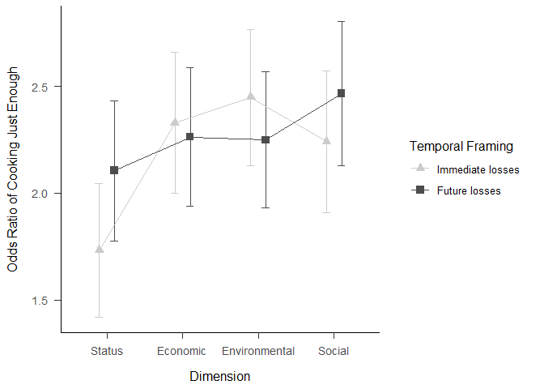

Food Waste
================
Nuno Fernandes

## Preprocessing

### read.csv

``` r
#setwd("~/2021/food waste")
food<-read.csv("Comportamento_Alimentar.csv")
```

### packages

``` r
packages <- c("glmm", "lmerTest", "lme4", "Hmisc", "lattice", "ggplot2", "sjPlot", "effects", "plyr")

installed_packages <- packages %in% row.names(installed.packages())
if (any(installed_packages == FALSE)) {
  install.packages(packages[!installed.packages])
}

lapply(packages, library, character.only = TRUE)
```

### coding dimension

``` r
food$Dimension[food$Dimension==1]<-"aStatus"
food$Dimension[food$Dimension==2]<-"Environment"
food$Dimension[food$Dimension==3]<-"Economic"
food$Dimension[food$Dimension==4]<-"Social"
```

### coding temporal framing

``` r
food$Tem_Val[food$Tem_Val==0]<-"P+F-"
food$Tem_Val[food$Tem_Val==1]<-"P-F+"
```

### coding dv:food choices

``` r
food$escolha[food$escolha==0]<-"extra"
food$escolha[food$escolha==1]<-"enough"
```

### as.factor

``` r
#food$id<-food$ï..id 
food$id<-as.factor(food$id)
food$Scenario<-as.factor(food$Scenario)
food$Dimension<-as.factor(food$Dimension)
food$Tem_Val<-as.factor(food$Tem_Val)
food$escolha<-as.factor(food$escolha)
```

## Statistical Analysis

``` r
m1<- glmer(escolha ~ Dimension*Tem_Val + Q_comida_fora + Dimension + (1|id/Scenario),
           data = food, family = binomial, control = glmerControl(optimizer = "bobyqa"))

m2<- glmer(escolha ~ Dimension*Q_consumo_sustentavel +  Q_comida_fora + (1|id/Scenario),
           data = food, family = binomial, control = glmerControl(optimizer = "bobyqa"))
```

### summary m1

``` r
summary(m1)
```

    ## Generalized linear mixed model fit by maximum likelihood (Laplace
    ##   Approximation) [glmerMod]
    ##  Family: binomial  ( logit )
    ## Formula: escolha ~ Dimension * Tem_Val + Q_comida_fora + Dimension + (1 |  
    ##     id/Scenario)
    ##    Data: food
    ## Control: glmerControl(optimizer = "bobyqa")
    ## 
    ##      AIC      BIC   logLik deviance df.resid 
    ##   1646.9   1708.3   -812.4   1624.9     1957 
    ## 
    ## Scaled residuals: 
    ##     Min      1Q  Median      3Q     Max 
    ## -5.2686  0.1074  0.1312  0.4484  1.8215 
    ## 
    ## Random effects:
    ##  Groups      Name        Variance  Std.Dev. 
    ##  Scenario:id (Intercept) 5.366e-14 2.316e-07
    ##  id          (Intercept) 4.986e+00 2.233e+00
    ## Number of obs: 1968, groups:  Scenario:id, 1968; id, 82
    ## 
    ## Fixed effects:
    ##                                  Estimate Std. Error z value Pr(>|z|)   
    ## (Intercept)                        0.8626     1.0097   0.854   0.3929   
    ## DimensionEconomic                  0.5980     0.2547   2.348   0.0189 * 
    ## DimensionEnvironment               0.7175     0.2382   3.012   0.0026 **
    ## DimensionSocial                    0.5099     0.2583   1.974   0.0484 * 
    ## Tem_ValP+F-                        0.3736     0.2542   1.470   0.1416   
    ## Q_comida_fora                      0.3295     0.3667   0.899   0.3688   
    ## DimensionEconomic:Tem_ValP+F-     -0.4398     0.3642  -1.208   0.2272   
    ## DimensionEnvironment:Tem_ValP+F-  -0.5740     0.3449  -1.664   0.0961 . 
    ## DimensionSocial:Tem_ValP+F-       -0.1486     0.3796  -0.391   0.6954   
    ## ---
    ## Signif. codes:  0 '***' 0.001 '**' 0.01 '*' 0.05 '.' 0.1 ' ' 1
    ## 
    ## Correlation of Fixed Effects:
    ##                 (Intr) DmnsnEc DmnsnEn DmnsnS T_VP+F Q_cmd_ DmnsnEc:T_VP+F-
    ## DimnsnEcnmc     -0.113                                                     
    ## DmnsnEnvrnm     -0.115  0.475                                              
    ## DimensinScl     -0.108  0.431   0.465                                      
    ## Tem_ValP+F-     -0.106  0.427   0.460   0.418                              
    ## Q_comida_fr     -0.950  0.006   0.004   0.002 -0.001                       
    ## DmnsnEc:T_VP+F-  0.075 -0.685  -0.318  -0.294 -0.691 -0.001                
    ## DmnsnEn:T_VP+F-  0.078 -0.315  -0.671  -0.312 -0.731  0.000  0.508         
    ## DmS:T_VP+F-      0.075 -0.287  -0.309  -0.672 -0.662 -0.003  0.463         
    ##                 DmnsnEn:T_VP+F-
    ## DimnsnEcnmc                    
    ## DmnsnEnvrnm                    
    ## DimensinScl                    
    ## Tem_ValP+F-                    
    ## Q_comida_fr                    
    ## DmnsnEc:T_VP+F-                
    ## DmnsnEn:T_VP+F-                
    ## DmS:T_VP+F-      0.489         
    ## optimizer (bobyqa) convergence code: 0 (OK)
    ## boundary (singular) fit: see help('isSingular')

``` r
anova(m1)
```

    ## Analysis of Variance Table
    ##                   npar Sum Sq Mean Sq F value
    ## Dimension            3 8.4881 2.82938  2.8294
    ## Tem_Val              1 0.2316 0.23164  0.2316
    ## Q_comida_fora        1 0.7943 0.79427  0.7943
    ## Dimension:Tem_Val    3 3.2658 1.08862  1.0886

### Confidence Intervals m1

``` r
confint(m1, method = "Wald")
```

    ##                                         2.5 %    97.5 %
    ## .sig01                                     NA        NA
    ## .sig02                                     NA        NA
    ## (Intercept)                      -1.116427850 2.8416933
    ## DimensionEconomic                 0.098834276 1.0972609
    ## DimensionEnvironment              0.250589022 1.1843747
    ## DimensionSocial                   0.003662605 1.0160513
    ## Tem_ValP+F-                      -0.124602087 0.8718019
    ## Q_comida_fora                    -0.389167340 1.0482030
    ## DimensionEconomic:Tem_ValP+F-    -1.153703340 0.2740350
    ## DimensionEnvironment:Tem_ValP+F- -1.249910482 0.1019641
    ## DimensionSocial:Tem_ValP+F-      -0.892619003 0.5954007

### table m1 - escolha \~ Dimension \* Tem_Val + Q_comida_fora + (1 \| id/Scenario)

``` r
tab_model(m1)
```

<table style="border-collapse:collapse; border:none;">
<tr>
<th style="border-top: double; text-align:center; font-style:normal; font-weight:bold; padding:0.2cm;  text-align:left; ">
 
</th>
<th colspan="3" style="border-top: double; text-align:center; font-style:normal; font-weight:bold; padding:0.2cm; ">
escolha
</th>
</tr>
<tr>
<td style=" text-align:center; border-bottom:1px solid; font-style:italic; font-weight:normal;  text-align:left; ">
Predictors
</td>
<td style=" text-align:center; border-bottom:1px solid; font-style:italic; font-weight:normal;  ">
Odds Ratios
</td>
<td style=" text-align:center; border-bottom:1px solid; font-style:italic; font-weight:normal;  ">
CI
</td>
<td style=" text-align:center; border-bottom:1px solid; font-style:italic; font-weight:normal;  ">
p
</td>
</tr>
<tr>
<td style=" padding:0.2cm; text-align:left; vertical-align:top; text-align:left; ">
(Intercept)
</td>
<td style=" padding:0.2cm; text-align:left; vertical-align:top; text-align:center;  ">
2.37
</td>
<td style=" padding:0.2cm; text-align:left; vertical-align:top; text-align:center;  ">
0.33 – 17.14
</td>
<td style=" padding:0.2cm; text-align:left; vertical-align:top; text-align:center;  ">
0.393
</td>
</tr>
<tr>
<td style=" padding:0.2cm; text-align:left; vertical-align:top; text-align:left; ">
Dimension \[Economic\]
</td>
<td style=" padding:0.2cm; text-align:left; vertical-align:top; text-align:center;  ">
1.82
</td>
<td style=" padding:0.2cm; text-align:left; vertical-align:top; text-align:center;  ">
1.10 – 3.00
</td>
<td style=" padding:0.2cm; text-align:left; vertical-align:top; text-align:center;  ">
<strong>0.019</strong>
</td>
</tr>
<tr>
<td style=" padding:0.2cm; text-align:left; vertical-align:top; text-align:left; ">
Dimension \[Environment\]
</td>
<td style=" padding:0.2cm; text-align:left; vertical-align:top; text-align:center;  ">
2.05
</td>
<td style=" padding:0.2cm; text-align:left; vertical-align:top; text-align:center;  ">
1.28 – 3.27
</td>
<td style=" padding:0.2cm; text-align:left; vertical-align:top; text-align:center;  ">
<strong>0.003</strong>
</td>
</tr>
<tr>
<td style=" padding:0.2cm; text-align:left; vertical-align:top; text-align:left; ">
Dimension \[Social\]
</td>
<td style=" padding:0.2cm; text-align:left; vertical-align:top; text-align:center;  ">
1.67
</td>
<td style=" padding:0.2cm; text-align:left; vertical-align:top; text-align:center;  ">
1.00 – 2.76
</td>
<td style=" padding:0.2cm; text-align:left; vertical-align:top; text-align:center;  ">
<strong>0.048</strong>
</td>
</tr>
<tr>
<td style=" padding:0.2cm; text-align:left; vertical-align:top; text-align:left; ">
Tem Val \[P+F-\]
</td>
<td style=" padding:0.2cm; text-align:left; vertical-align:top; text-align:center;  ">
1.45
</td>
<td style=" padding:0.2cm; text-align:left; vertical-align:top; text-align:center;  ">
0.88 – 2.39
</td>
<td style=" padding:0.2cm; text-align:left; vertical-align:top; text-align:center;  ">
0.142
</td>
</tr>
<tr>
<td style=" padding:0.2cm; text-align:left; vertical-align:top; text-align:left; ">
Q comida fora
</td>
<td style=" padding:0.2cm; text-align:left; vertical-align:top; text-align:center;  ">
1.39
</td>
<td style=" padding:0.2cm; text-align:left; vertical-align:top; text-align:center;  ">
0.68 – 2.85
</td>
<td style=" padding:0.2cm; text-align:left; vertical-align:top; text-align:center;  ">
0.369
</td>
</tr>
<tr>
<td style=" padding:0.2cm; text-align:left; vertical-align:top; text-align:left; ">
Dimension \[Economic\] \*<br>Tem Val \[P+F-\]
</td>
<td style=" padding:0.2cm; text-align:left; vertical-align:top; text-align:center;  ">
0.64
</td>
<td style=" padding:0.2cm; text-align:left; vertical-align:top; text-align:center;  ">
0.32 – 1.32
</td>
<td style=" padding:0.2cm; text-align:left; vertical-align:top; text-align:center;  ">
0.227
</td>
</tr>
<tr>
<td style=" padding:0.2cm; text-align:left; vertical-align:top; text-align:left; ">
Dimension \[Environment\] \*<br>Tem Val \[P+F-\]
</td>
<td style=" padding:0.2cm; text-align:left; vertical-align:top; text-align:center;  ">
0.56
</td>
<td style=" padding:0.2cm; text-align:left; vertical-align:top; text-align:center;  ">
0.29 – 1.11
</td>
<td style=" padding:0.2cm; text-align:left; vertical-align:top; text-align:center;  ">
0.096
</td>
</tr>
<tr>
<td style=" padding:0.2cm; text-align:left; vertical-align:top; text-align:left; ">
Dimension \[Social\] \* Tem<br>Val \[P+F-\]
</td>
<td style=" padding:0.2cm; text-align:left; vertical-align:top; text-align:center;  ">
0.86
</td>
<td style=" padding:0.2cm; text-align:left; vertical-align:top; text-align:center;  ">
0.41 – 1.81
</td>
<td style=" padding:0.2cm; text-align:left; vertical-align:top; text-align:center;  ">
0.695
</td>
</tr>
<tr>
<td colspan="4" style="font-weight:bold; text-align:left; padding-top:.8em;">
Random Effects
</td>
</tr>
<tr>
<td style=" padding:0.2cm; text-align:left; vertical-align:top; text-align:left; padding-top:0.1cm; padding-bottom:0.1cm;">
σ<sup>2</sup>
</td>
<td style=" padding:0.2cm; text-align:left; vertical-align:top; padding-top:0.1cm; padding-bottom:0.1cm; text-align:left;" colspan="3">
3.29
</td>
</tr>
<tr>
<td style=" padding:0.2cm; text-align:left; vertical-align:top; text-align:left; padding-top:0.1cm; padding-bottom:0.1cm;">
τ<sub>00</sub> <sub>Scenario:id</sub>
</td>
<td style=" padding:0.2cm; text-align:left; vertical-align:top; padding-top:0.1cm; padding-bottom:0.1cm; text-align:left;" colspan="3">
0.00
</td>
<tr>
<td style=" padding:0.2cm; text-align:left; vertical-align:top; text-align:left; padding-top:0.1cm; padding-bottom:0.1cm;">
τ<sub>00</sub> <sub>id</sub>
</td>
<td style=" padding:0.2cm; text-align:left; vertical-align:top; padding-top:0.1cm; padding-bottom:0.1cm; text-align:left;" colspan="3">
4.99
</td>
<tr>
<td style=" padding:0.2cm; text-align:left; vertical-align:top; text-align:left; padding-top:0.1cm; padding-bottom:0.1cm;">
N <sub>Scenario</sub>
</td>
<td style=" padding:0.2cm; text-align:left; vertical-align:top; padding-top:0.1cm; padding-bottom:0.1cm; text-align:left;" colspan="3">
24
</td>
<tr>
<td style=" padding:0.2cm; text-align:left; vertical-align:top; text-align:left; padding-top:0.1cm; padding-bottom:0.1cm;">
N <sub>id</sub>
</td>
<td style=" padding:0.2cm; text-align:left; vertical-align:top; padding-top:0.1cm; padding-bottom:0.1cm; text-align:left;" colspan="3">
82
</td>
<tr>
<td style=" padding:0.2cm; text-align:left; vertical-align:top; text-align:left; padding-top:0.1cm; padding-bottom:0.1cm; border-top:1px solid;">
Observations
</td>
<td style=" padding:0.2cm; text-align:left; vertical-align:top; padding-top:0.1cm; padding-bottom:0.1cm; text-align:left; border-top:1px solid;" colspan="3">
1968
</td>
</tr>
<tr>
<td style=" padding:0.2cm; text-align:left; vertical-align:top; text-align:left; padding-top:0.1cm; padding-bottom:0.1cm;">
Marginal R<sup>2</sup> / Conditional R<sup>2</sup>
</td>
<td style=" padding:0.2cm; text-align:left; vertical-align:top; padding-top:0.1cm; padding-bottom:0.1cm; text-align:left;" colspan="3">
0.032 / NA
</td>
</tr>
</table>

### summary m2

``` r
summary(m2)
```

    ## Generalized linear mixed model fit by maximum likelihood (Laplace
    ##   Approximation) [glmerMod]
    ##  Family: binomial  ( logit )
    ## Formula: escolha ~ Dimension * Q_consumo_sustentavel + Q_comida_fora +  
    ##     (1 | id/Scenario)
    ##    Data: food
    ## Control: glmerControl(optimizer = "bobyqa")
    ## 
    ##      AIC      BIC   logLik deviance df.resid 
    ##   1632.8   1693.4   -805.4   1610.8     1813 
    ## 
    ## Scaled residuals: 
    ##     Min      1Q  Median      3Q     Max 
    ## -4.8335  0.1154  0.1653  0.4891  1.7284 
    ## 
    ## Random effects:
    ##  Groups      Name        Variance Std.Dev.
    ##  Scenario:id (Intercept) 0.000    0.000   
    ##  id          (Intercept) 4.173    2.043   
    ## Number of obs: 1824, groups:  Scenario:id, 1824; id, 76
    ## 
    ## Fixed effects:
    ##                                            Estimate Std. Error z value Pr(>|z|)
    ## (Intercept)                                -0.24805    2.08224  -0.119    0.905
    ## DimensionEconomic                           0.79405    1.03816   0.765    0.444
    ## DimensionEnvironment                        0.22648    0.98823   0.229    0.819
    ## DimensionSocial                             0.18547    1.06192   0.175    0.861
    ## Q_consumo_sustentavel                       0.12990    0.29800   0.436    0.663
    ## Q_comida_fora                               0.44337    0.36652   1.210    0.226
    ## DimensionEconomic:Q_consumo_sustentavel    -0.07493    0.19286  -0.389    0.698
    ## DimensionEnvironment:Q_consumo_sustentavel  0.04270    0.18369   0.232    0.816
    ## DimensionSocial:Q_consumo_sustentavel       0.05148    0.19980   0.258    0.797
    ## 
    ## Correlation of Fixed Effects:
    ##             (Intr) DmnsnEc DmnsnEn DmnsnS Q_cns_ Q_cmd_ DmnsnEc:Q__ DmnsnEn:Q__
    ## DimnsnEcnmc -0.225                                                             
    ## DmnsnEnvrnm -0.233  0.483                                                      
    ## DimensinScl -0.222  0.448   0.481                                              
    ## Q_cnsm_sstn -0.887  0.285   0.299   0.283                                      
    ## Q_comida_fr -0.681  0.005  -0.004   0.001  0.291                               
    ## DmnsnEc:Q__  0.220 -0.984  -0.474  -0.440 -0.289 -0.003                        
    ## DmnsnEn:Q__  0.228 -0.474  -0.984  -0.470 -0.303  0.005  0.481                 
    ## DmnsnSc:Q__  0.215 -0.435  -0.465  -0.984 -0.284  0.000  0.441       0.470     
    ## optimizer (bobyqa) convergence code: 0 (OK)
    ## boundary (singular) fit: see help('isSingular')

``` r
anova(m2)
```

    ## Analysis of Variance Table
    ##                                 npar Sum Sq Mean Sq F value
    ## Dimension                          3 8.4155 2.80516  2.8052
    ## Q_consumo_sustentavel              1 0.0140 0.01404  0.0140
    ## Q_comida_fora                      1 1.4357 1.43567  1.4357
    ## Dimension:Q_consumo_sustentavel    3 0.4859 0.16196  0.1620

### Confidence Intervals m2

``` r
confint(m2, method = "Wald")
```

    ##                                                 2.5 %    97.5 %
    ## .sig01                                             NA        NA
    ## .sig02                                             NA        NA
    ## (Intercept)                                -4.3291622 3.8330576
    ## DimensionEconomic                          -1.2407144 2.8288109
    ## DimensionEnvironment                       -1.7104168 2.1633795
    ## DimensionSocial                            -1.8958552 2.2667865
    ## Q_consumo_sustentavel                      -0.4541755 0.7139769
    ## Q_comida_fora                              -0.2749887 1.1617375
    ## DimensionEconomic:Q_consumo_sustentavel    -0.4529378 0.3030701
    ## DimensionEnvironment:Q_consumo_sustentavel -0.3173298 0.4027282
    ## DimensionSocial:Q_consumo_sustentavel      -0.3401162 0.4430797

### table m2 - escolha \~ Dimension\*Q_consumo_sustentavel + Q_comida_fora + (1\|id/Scenario)

``` r
tab_model(m2)
```

<table style="border-collapse:collapse; border:none;">
<tr>
<th style="border-top: double; text-align:center; font-style:normal; font-weight:bold; padding:0.2cm;  text-align:left; ">
 
</th>
<th colspan="3" style="border-top: double; text-align:center; font-style:normal; font-weight:bold; padding:0.2cm; ">
escolha
</th>
</tr>
<tr>
<td style=" text-align:center; border-bottom:1px solid; font-style:italic; font-weight:normal;  text-align:left; ">
Predictors
</td>
<td style=" text-align:center; border-bottom:1px solid; font-style:italic; font-weight:normal;  ">
Odds Ratios
</td>
<td style=" text-align:center; border-bottom:1px solid; font-style:italic; font-weight:normal;  ">
CI
</td>
<td style=" text-align:center; border-bottom:1px solid; font-style:italic; font-weight:normal;  ">
p
</td>
</tr>
<tr>
<td style=" padding:0.2cm; text-align:left; vertical-align:top; text-align:left; ">
(Intercept)
</td>
<td style=" padding:0.2cm; text-align:left; vertical-align:top; text-align:center;  ">
0.78
</td>
<td style=" padding:0.2cm; text-align:left; vertical-align:top; text-align:center;  ">
0.01 – 46.20
</td>
<td style=" padding:0.2cm; text-align:left; vertical-align:top; text-align:center;  ">
0.905
</td>
</tr>
<tr>
<td style=" padding:0.2cm; text-align:left; vertical-align:top; text-align:left; ">
Dimension \[Economic\]
</td>
<td style=" padding:0.2cm; text-align:left; vertical-align:top; text-align:center;  ">
2.21
</td>
<td style=" padding:0.2cm; text-align:left; vertical-align:top; text-align:center;  ">
0.29 – 16.93
</td>
<td style=" padding:0.2cm; text-align:left; vertical-align:top; text-align:center;  ">
0.444
</td>
</tr>
<tr>
<td style=" padding:0.2cm; text-align:left; vertical-align:top; text-align:left; ">
Dimension \[Environment\]
</td>
<td style=" padding:0.2cm; text-align:left; vertical-align:top; text-align:center;  ">
1.25
</td>
<td style=" padding:0.2cm; text-align:left; vertical-align:top; text-align:center;  ">
0.18 – 8.70
</td>
<td style=" padding:0.2cm; text-align:left; vertical-align:top; text-align:center;  ">
0.819
</td>
</tr>
<tr>
<td style=" padding:0.2cm; text-align:left; vertical-align:top; text-align:left; ">
Dimension \[Social\]
</td>
<td style=" padding:0.2cm; text-align:left; vertical-align:top; text-align:center;  ">
1.20
</td>
<td style=" padding:0.2cm; text-align:left; vertical-align:top; text-align:center;  ">
0.15 – 9.65
</td>
<td style=" padding:0.2cm; text-align:left; vertical-align:top; text-align:center;  ">
0.861
</td>
</tr>
<tr>
<td style=" padding:0.2cm; text-align:left; vertical-align:top; text-align:left; ">
Q consumo sustentavel
</td>
<td style=" padding:0.2cm; text-align:left; vertical-align:top; text-align:center;  ">
1.14
</td>
<td style=" padding:0.2cm; text-align:left; vertical-align:top; text-align:center;  ">
0.63 – 2.04
</td>
<td style=" padding:0.2cm; text-align:left; vertical-align:top; text-align:center;  ">
0.663
</td>
</tr>
<tr>
<td style=" padding:0.2cm; text-align:left; vertical-align:top; text-align:left; ">
Q comida fora
</td>
<td style=" padding:0.2cm; text-align:left; vertical-align:top; text-align:center;  ">
1.56
</td>
<td style=" padding:0.2cm; text-align:left; vertical-align:top; text-align:center;  ">
0.76 – 3.20
</td>
<td style=" padding:0.2cm; text-align:left; vertical-align:top; text-align:center;  ">
0.226
</td>
</tr>
<tr>
<td style=" padding:0.2cm; text-align:left; vertical-align:top; text-align:left; ">
Dimension \[Economic\] \* Q<br>consumo sustentavel
</td>
<td style=" padding:0.2cm; text-align:left; vertical-align:top; text-align:center;  ">
0.93
</td>
<td style=" padding:0.2cm; text-align:left; vertical-align:top; text-align:center;  ">
0.64 – 1.35
</td>
<td style=" padding:0.2cm; text-align:left; vertical-align:top; text-align:center;  ">
0.698
</td>
</tr>
<tr>
<td style=" padding:0.2cm; text-align:left; vertical-align:top; text-align:left; ">
Dimension \[Environment\] \*<br>Q consumo sustentavel
</td>
<td style=" padding:0.2cm; text-align:left; vertical-align:top; text-align:center;  ">
1.04
</td>
<td style=" padding:0.2cm; text-align:left; vertical-align:top; text-align:center;  ">
0.73 – 1.50
</td>
<td style=" padding:0.2cm; text-align:left; vertical-align:top; text-align:center;  ">
0.816
</td>
</tr>
<tr>
<td style=" padding:0.2cm; text-align:left; vertical-align:top; text-align:left; ">
Dimension \[Social\] \* Q<br>consumo sustentavel
</td>
<td style=" padding:0.2cm; text-align:left; vertical-align:top; text-align:center;  ">
1.05
</td>
<td style=" padding:0.2cm; text-align:left; vertical-align:top; text-align:center;  ">
0.71 – 1.56
</td>
<td style=" padding:0.2cm; text-align:left; vertical-align:top; text-align:center;  ">
0.797
</td>
</tr>
<tr>
<td colspan="4" style="font-weight:bold; text-align:left; padding-top:.8em;">
Random Effects
</td>
</tr>
<tr>
<td style=" padding:0.2cm; text-align:left; vertical-align:top; text-align:left; padding-top:0.1cm; padding-bottom:0.1cm;">
σ<sup>2</sup>
</td>
<td style=" padding:0.2cm; text-align:left; vertical-align:top; padding-top:0.1cm; padding-bottom:0.1cm; text-align:left;" colspan="3">
3.29
</td>
</tr>
<tr>
<td style=" padding:0.2cm; text-align:left; vertical-align:top; text-align:left; padding-top:0.1cm; padding-bottom:0.1cm;">
τ<sub>00</sub> <sub>Scenario:id</sub>
</td>
<td style=" padding:0.2cm; text-align:left; vertical-align:top; padding-top:0.1cm; padding-bottom:0.1cm; text-align:left;" colspan="3">
0.00
</td>
<tr>
<td style=" padding:0.2cm; text-align:left; vertical-align:top; text-align:left; padding-top:0.1cm; padding-bottom:0.1cm;">
τ<sub>00</sub> <sub>id</sub>
</td>
<td style=" padding:0.2cm; text-align:left; vertical-align:top; padding-top:0.1cm; padding-bottom:0.1cm; text-align:left;" colspan="3">
4.17
</td>
<tr>
<td style=" padding:0.2cm; text-align:left; vertical-align:top; text-align:left; padding-top:0.1cm; padding-bottom:0.1cm;">
N <sub>Scenario</sub>
</td>
<td style=" padding:0.2cm; text-align:left; vertical-align:top; padding-top:0.1cm; padding-bottom:0.1cm; text-align:left;" colspan="3">
24
</td>
<tr>
<td style=" padding:0.2cm; text-align:left; vertical-align:top; text-align:left; padding-top:0.1cm; padding-bottom:0.1cm;">
N <sub>id</sub>
</td>
<td style=" padding:0.2cm; text-align:left; vertical-align:top; padding-top:0.1cm; padding-bottom:0.1cm; text-align:left;" colspan="3">
76
</td>
<tr>
<td style=" padding:0.2cm; text-align:left; vertical-align:top; text-align:left; padding-top:0.1cm; padding-bottom:0.1cm; border-top:1px solid;">
Observations
</td>
<td style=" padding:0.2cm; text-align:left; vertical-align:top; padding-top:0.1cm; padding-bottom:0.1cm; text-align:left; border-top:1px solid;" colspan="3">
1824
</td>
</tr>
<tr>
<td style=" padding:0.2cm; text-align:left; vertical-align:top; text-align:left; padding-top:0.1cm; padding-bottom:0.1cm;">
Marginal R<sup>2</sup> / Conditional R<sup>2</sup>
</td>
<td style=" padding:0.2cm; text-align:left; vertical-align:top; padding-top:0.1cm; padding-bottom:0.1cm; text-align:left;" colspan="3">
0.038 / NA
</td>
</tr>
</table>

## Data Visualization

\###Preprocessing to Plot main effect

``` r
#main effect
m3<- glmer(escolha ~ Dimension+ (1|id/Scenario),
           data = food, family = binomial, control = glmerControl(optimizer = "bobyqa"))
```

    ## boundary (singular) fit: see help('isSingular')

``` r
#estimates to dataframe
df <- as.data.frame(allEffects(m3))
df <- df$Dimension

#revalue Dimension
 revalue(df$Dimension, c("aStatus" = "Status", "Environment" = "Environmental")) -> df$Dimension

revalue(food$Dimension, c("aStatus" = "Status", "Environment" = "Environmental")) -> food$Dimension

#food$Dimension2 <- df$Dimension
#food$fit <- df$fit
```

### Probability of cooking just enough food (jitter) - <https://doi.org/10.1002/bdm.2274>

``` r
apatheme <- theme_bw(base_size = 12)+
  theme(panel.grid.major=element_blank(),
        panel.grid.minor=element_blank())

fixd.plot <- ggplot(df, aes(x = factor(Dimension), y = fit, group = 1))  +
  
  geom_point(data = food, aes(Dimension, PredictedProbability_01), position = position_jitter(width = .1), alpha = .2) +
  #geom_point(size = 1, colour = "grey60", alpha = .5, position = position_jitter(width = .3, height = 0)) +
  #geom_errorbar(data = food, aes(x = diff, y = m, ymin = m -sd, ymax = m + sd), 
                #position = position_nudge(x = -.2), width = .2) +
scale_x_discrete(name ="Dimension", 
                   limits=c("Status","Economic","Environmental","Social")) +
  
  #confirm if this is to remove or not
  #geom_point(data = food, aes(y = PredictedProbability_01), size = 4, position = position_nudge(x = -.2))  + 
  #error bar
  #stat_summary(fun.data=mean_sdl, fun.args = list(mult = .5), 
               #geom="errorbar", color="red", width = .1) + 
  #stat_summary(fun=mean, geom="point", color="red") +
  
  
  geom_point(data=df,aes(Dimension, fit),size=2, colour = "red")+
  
  geom_errorbar(data=df,aes(x=Dimension, ymin=lower, ymax=upper), colour = "red", width=0.2)+

    ylab("Probability of cooking just enough food") + xlab("Dimension") + apatheme
ggsave("figure4.pdf", width=4, height=4, unit='in', dpi=300)

fixd.plot
```

<!-- -->

``` r
#apa
theme_apa <- function(base_size = 12, base_family = "", box = FALSE) {
  adapted_theme <- ggplot2::theme_bw(base_size, base_family) +
    ggplot2::theme(
      plot.title = ggplot2::element_text(size = ggplot2::rel(1.1), margin = ggplot2::margin(0, 0, ggplot2::rel(14), 0), hjust = 0.5)
      , plot.subtitle = ggplot2::element_text(size = ggplot2::rel(0.8), margin = ggplot2::margin(ggplot2::rel(-7), 0, ggplot2::rel(14), 0), hjust = 0.5)

      # , axis.title = ggplot2::element_text(size = ggplot2::rel(1.1))
      , axis.title.x = ggplot2::element_text(size = ggplot2::rel(1), lineheight = ggplot2::rel(1.1), margin = ggplot2::margin(ggplot2::rel(12), 0, 0, 0))
      , axis.title.x.top = ggplot2::element_text(size = ggplot2::rel(1), lineheight = ggplot2::rel(1.1), margin = ggplot2::margin(0, 0, ggplot2::rel(12), 0))
      , axis.title.y = ggplot2::element_text(size = ggplot2::rel(1), lineheight = ggplot2::rel(1.1), margin = ggplot2::margin(0, ggplot2::rel(12), 0, 0))
      , axis.title.y.right = ggplot2::element_text(size = ggplot2::rel(1), lineheight = ggplot2::rel(1.1), margin = ggplot2::margin(0, 0, 0, ggplot2::rel(12)))
      , axis.ticks.length = ggplot2::unit(ggplot2::rel(6), "points")
      , axis.text = ggplot2::element_text(size = ggplot2::rel(0.9))
      , axis.text.x = ggplot2::element_text(size = ggplot2::rel(1), margin = ggplot2::margin(ggplot2::rel(6), 0, 0, 0))
      , axis.text.y = ggplot2::element_text(size = ggplot2::rel(1), margin = ggplot2::margin(0, ggplot2::rel(6), 0, 0))
      , axis.text.y.right = ggplot2::element_text(size = ggplot2::rel(1), margin = ggplot2::margin(0, 0, 0, ggplot2::rel(6)))
      , axis.line = ggplot2::element_line()
      # , axis.line.x = ggplot2::element_line()
      # , axis.line.y = ggplot2::element_line()

      , legend.title = ggplot2::element_text()
      , legend.key = ggplot2::element_rect(fill = NA, color = NA)
      , legend.key.width = ggplot2::unit(ggplot2::rel(20), "points")
      , legend.key.height = ggplot2::unit(ggplot2::rel(20), "points")
      , legend.margin = ggplot2::margin(
        t = ggplot2::rel(16)
        , r = ggplot2::rel(16)
        , b = ggplot2::rel(16)
        , l = ggplot2::rel(16)
        , unit = "points"
      )

      , panel.spacing = ggplot2::unit(ggplot2::rel(14), "points")
      , panel.grid.major.x = ggplot2::element_blank()
      , panel.grid.minor.x = ggplot2::element_blank()
      , panel.grid.major.y = ggplot2::element_blank()
      , panel.grid.minor.y = ggplot2::element_blank()

      , strip.background = ggplot2::element_rect(fill = NA, color = NA)
      , strip.text.x = ggplot2::element_text(size = ggplot2::rel(1.2), margin = ggplot2::margin(0, 0, ggplot2::rel(10), 0))
      , strip.text.y = ggplot2::element_text(size = ggplot2::rel(1.2), margin = ggplot2::margin(0, 0, 0, ggplot2::rel(10)))
    )

  if(box) {
    adapted_theme <- adapted_theme + ggplot2::theme(panel.border = ggplot2::element_rect(color = "black"))
  } else {
    adapted_theme <- adapted_theme + ggplot2::theme(panel.border = ggplot2::element_blank())
  }

  adapted_theme
}
```

### Probability of cooking just enough food Dimension\*Temporal_Framing

``` r
#preprocess estimates
df1 <- as.data.frame(allEffects(m1))
df1 <- df1$Dimension

#change labels
revalue(df1$Tem_Val, c("P-F+" = "Immediate losses", "P+F-" = "Future losses")) -> df1$Tem_Val

#legend
legend <- "Temporal Framing"

apatheme <- theme_bw(base_size = 12)+
  theme(panel.grid.major=element_blank(),
        panel.grid.minor=element_blank())

int_plot <- ggplot(df1, aes(x = factor(Dimension), y = fit))  +
  
scale_x_discrete(name ="Dimension", 
                   limits=c("Status","Economic","Environmental","Social")) +

  
  geom_errorbar(data=df1,aes(x=Dimension, ymin=lower, ymax=upper, color = Tem_Val), position = position_dodge((0.4)), width = 0.2)+
  
    #shape
  scale_shape_manual(values=c(21,24)) + 
  
     scale_fill_manual(values=c("white","black"))+
  
geom_point(aes(color = Tem_Val, shape = Tem_Val), size = 3, position = position_dodge(0.4))+ #scale_color_manual(values = c("#00AFBB", "#E7B800"))+
  
  #colour
  scale_color_manual(values = c("grey80", "grey30"), legend)+
  
  #shape
  scale_shape_manual(legend, values=c(17,15))+

    ylab("Probability of cooking just enough food") + xlab("Dimension") +
  
  #apatheme
  theme_apa()
```

    ## Scale for 'shape' is already present. Adding another scale for 'shape', which
    ## will replace the existing scale.

``` r
ggsave("figure4.pdf", width=4, height=4, unit='in', dpi=300)

int_plot
```

<!-- --> \###
Probability of cooking just enough food Dimension\*Temporal_Framing

``` r
#preprocess estimates
df1 <- as.data.frame(allEffects(m1))
df1 <- df1$Dimension


#legend

apatheme <- theme_bw(base_size = 12)+
  theme(panel.grid.major=element_blank(),
        panel.grid.minor=element_blank())

int_plot <- ggplot(df, aes(x = factor(Dimension), y = fit, group = 1))  +
  
scale_x_discrete(name ="Dimension", 
                   limits=c("Status","Economic","Environmental","Social")) +

  
  
  geom_errorbar(data=df,aes(x=Dimension, ymin=lower, ymax=upper), width=0.2)+
  
  
    #shape
 # scale_shape_manual(values=c(21,24)) + 
  
 #    scale_fill_manual(values=c("white","black"))+
  
geom_point(size = 3, position = position_dodge(0.4))+ #scale_color_manual(values = c("#00AFBB", "#E7B800"))+
  geom_line()+ 
  
    annotate("text", x = 1.5, y = 0.91, label = "*p<.05") +
  

    ylab("Probability of cooking just enough food") + xlab("Dimension") +
  
  #apatheme
  theme_apa()
ggsave("figure4.pdf", width=4, height=4, unit='in', dpi=300)

int_plot
```

<!-- -->
